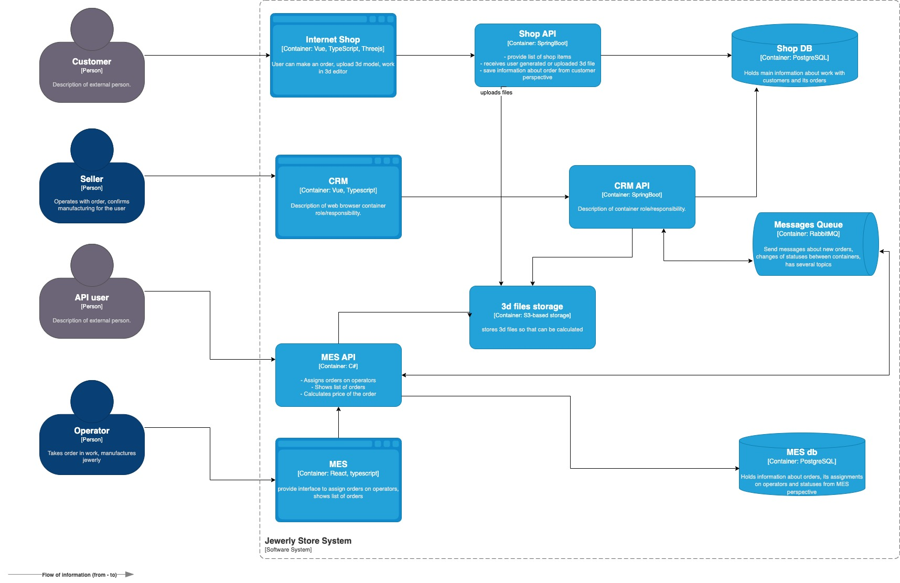

# Architecture Sprint 4 — Alexandrite

Репозиторий содержит решения пяти заданий 4-го спринта курса «Архитектур ПО» Яндекс Практикума.  
Каждое задание оформлено в собственной директории (`Task1` … `Task5`) и снабжено технической документацией и диаграммами.

## Структура репозитория
- **Task1/** — Анализ проблем и план инициатив
- **Task2/** — Мониторинг
- **Task3/** — Трейсинг
- **Task4/** — Логирование
- **Task5/** — Кеширование

Каждая директория содержит файл с архитектурным решением и сопутствующими диаграммами.

* **Stack:** Vue, React, Java Spring Boot, C#, RabbitMQ, PostgreSQL, Redis, OpenTelemetry, ELK.  
* **Содержание:** анализ архитектуры, мониторинг, трейсинг, логирование, кеширование.  
* **Диаграммы:** C4 и sequence-диаграммы расположены в соответствующих каталогах задач.

---

> Схема текущей архитектуры в модели C4 приложена в виде изображения.

