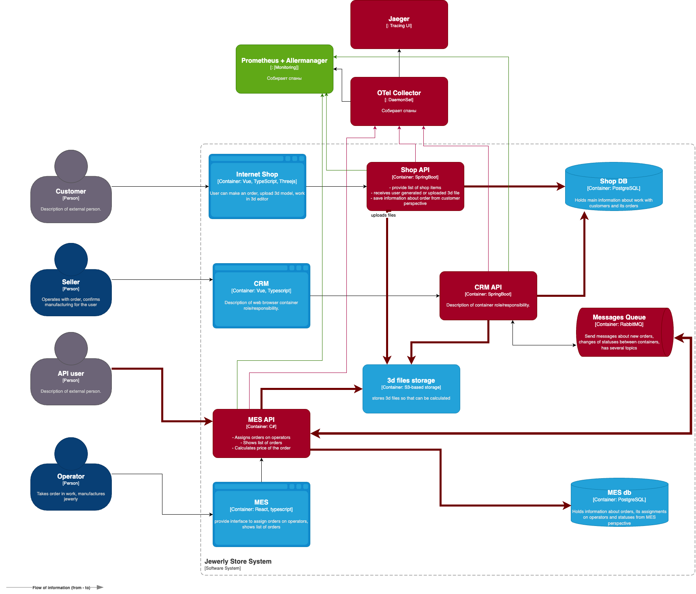

# Архитектурное решение по трейсингу

## Цель
Обеспечить сквозную видимость жизненного цикла заказа, сократить MTTR и устранить «чёрные ящики» между сервисами.

---

## 1. Точки, где заказ может «сломаться»
| № | Этап | Компонент | Риск |
|---|------|-----------|------|
| 1 | Создание заказа | Shop API → Shop DB | Запись в БД не удалась, 3D-файл не загрузился в S3 |
| 2 | Передача события | Shop API → RabbitMQ | Сообщение не опубликовано / потеряно |
| 3 | Создание CRM-записи | CRM consumer → CRM API | Ошибка при сохранении заказа или таймаут БД |
| 4 | Публикация `PRICE_CALCULATED` | CRM publisher → RabbitMQ | Событие не дошло до брокера |
| 5 | Приём в производство | MES consumer → MES API | Сообщение не доставлено / не обработано |
| 6 | Расчёт стоимости | MES worker-pool | Долгое вычисление, ошибка парсинга 3D |
| 7 | Сохранение статуса | MES API → MES DB | Запись «зависла» / откат транзакции |

*(На C4-диаграмме эти узлы и стрелки выделены красным; новые компоненты трейсинга — Collector и Jaeger — также красные.)*

---

## 2. Состав данных трассировки
| Поле | Пример | Назначение |
|------|--------|------------|
| `trace_id` | `4bf92f35…` | Сквозной ID заказа/запроса |
| `span_id` / `parent_span_id` | `00f067aa…` | Иерархия шагов |
| `order_id` | `ORD-2025-000123` | Быстрый поиск трейса |
| `event` | `CreateOrder`, `CalcPrice` | Понятный бизнес-шаг |
| `status` | `OK / ERROR` | Диагностика сбоев |
| `duration_ms` | `1534` | Поиск задержек |
| `error.*` | stacktrace, code | Причина падения |
| `resource.*` | сервис, версия, host | Корреляция с релизами |
| `order_id` / `user_id` / `status` | `ORD-… / U-501 / OK` | Минимальный набор `span attributes` для быстрых поисков |

---

## 3. Мотивация и KPI
| Метрика | Было | Цель |
|---------|------|------|
| MTTR | ≈ 4 ч | < 30 мин |
| «Потерянные» заказы | 2 % | < 0.2 % |
| SLA B2B | — | 99.9 % uptime доказуемо |
| Тикеты «Где заказ?» | 40/нед | < 10/нед |

Трейсинг даёт прозрачность процесса и снижает ручную рутину поддержки.

---

## 4. Предлагаемое решение
### 4.1 Технологический стек
| Компонент | Роль |
|-----------|------|
| **OpenTelemetry SDK** (Java / .NET) | Инструментирование Shop API, CRM API, MES API |
| **AMQP context-propagation** | Заголовок `traceparent` в RabbitMQ |
| **OTel Collector** (DaemonSet) | Получает спаны, экспортирует дальше |
| **Jaeger** (Badger/S3, 7 дней) | Хранилище и UI трассировок |
| **Prometheus + Alertmanager** | Метрики из спанов → алерты (зелёный слой) |

### 4.2 Поток
1. Shop API генерирует `trace_id`, span `CreateOrder` (tag `order_id`).
2. Публикует сообщение в RabbitMQ с контекстом.
3. CRM consumer извлекает контекст, span `CreateCRMRecord`.
4. CRM publisher отправляет `PRICE_CALCULATED` с тем же контекстом.
5. MES consumer → span `QueueToWork` → вызывает worker.
6. Worker → span `CalcPrice` (error / длительность).
7. MES API сохраняет статус, закрывает trace.

### 4.3 Мониторинг + алертинг (зелёный слой)
- Метрика `calc_price_duration_ms{quantile="0.95"} > 180 000` ms → PagerDuty.
- Выражение «span CRM → MES не пришёл за 10 мин» → Slack `#alerts`.

*(Отражено на диаграмме зелёными линиями к Prometheus.)*

---

## 5. Компромиссы
| Ограничение | Комментарий |
|-------------|-------------|
| Хранение 7 дней в Jaeger Badger | Архив > 7 дн складываем в S3 (cron). |
| Проприетарные внешние сервисы | Будут «чёрным ящиком»; трассируем только границу. |
| Доп. трафик телеметрии | ≈ 1 МБ/с при 200 RPS; при росте ×10 включим сэмплинг. |
- **Retention**: храним 7 дней в hot-storage (Badger), 30 дней в S3-архиве (cold).  
- **Трафик телеметрии**: ~5 КБ / заказ. При 200 RPS ≈ 1 МБ/с – допустимо. При x10 трафике переключаем storage на Tempo + S3.
- **Патч RabbitMQ framework**: требуется внедрить header-propagation (Spring AMQP / MassTransit). Оценка трудозатрат: 2 дня.
- **Сложные 3D-расчёты**: поток C#-worker не всегда HTTP — понадобится custom instrumentation.
- **Сэмплинг**: по умолчанию 100 %, при росте нагрузки можно перейти на 10 % parent-based.

---

## 6. Безопасность
- SSO + RBAC на Jaeger UI (роль *support-viewer*).
- TLS между OTel-SDK ↔ Collector ↔ Jaeger.
- PII scrub: email/телефон хэшируются; секреты не логируются.
- Отдельная VPC, доступ внешним подрядчикам только по VPN.

---

## 7. Итог
Внедрение OpenTelemetry → Jaeger обеспечит сквозную картину пути заказа, сократит потери и ускорит диагностику. Затраты ≈ 1–1.5 недели DevOps + Backend окупятся после первого предотвращённого инцидента. 