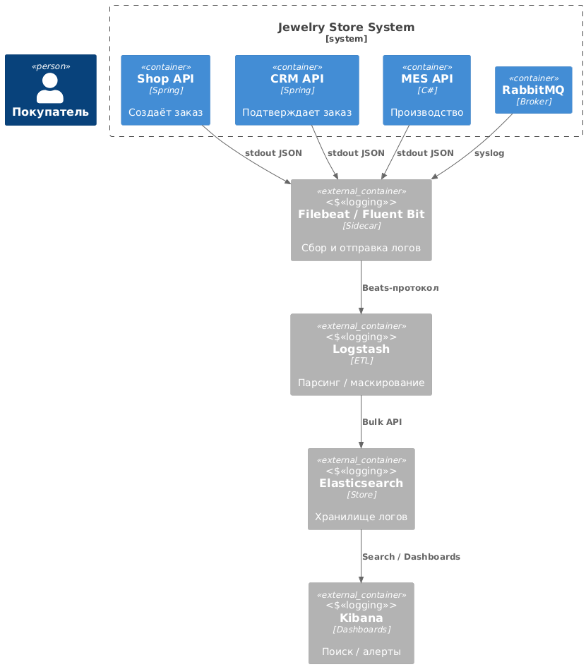

# Архитектурное решение по логированию

Стек: **Filebeat → Logstash → Elasticsearch → Kibana (ELK)**  
Цель: сократить MTTR, упростить поиск «потерянных» заказов и уменьшить нагрузку поддержки без платных решений.

⸻

## 1. Мотивация

| Pain-point | Как решает логирование | Ожидаемая метрика |
|------------|-----------------------|-------------------|
| Инциденты расследуются «со слов клиента» | Структурированные логи + дашборды | **MTTR ↓** с 4 ч до < 30 мин |
| Теряются/зависают заказы | По `orderId` ищем всю трассу в логах | Потерянные заказы ↓ 2 % → **0.2 %** |
| Поддержка тонет в тикетах «где мой заказ?» | Алерты/фильтры, видим статус онлайн | Тикеты ↓ **75 %** |
| Релизы пугают команду | Быстрый rollback по ERROR-спайку | Release frequency ↑ |
| Атаку/фрод видим слишком поздно | WARN/SECURITY-алерты + аномалии | **MTTD** безопасности ↓ |

⸻

## 2. Приоритет систем
1. **Shop API ⇆ CRM API ⇆ RabbitMQ** — критическая цепочка создания/подтверждения заказа.  
2. **MES API + MES DB** — производство; влияет на сроки.  
3. Инфра-компоненты (Nginx, DB slow-query, балансировщик) — после стабилизации основных.

⸻

## 3. Что логируем (INFO-уровень)

| Сервис | Событие | Поля |
|--------|---------|------|
| Shop API | Создание заказа | `timestamp`, `traceId`, `orderId`, `userId`, `amount` |
| Shop API | Файл 3D загружен | `orderId`, `fileKey`, `fileSize` |
| CRM API | Статус заказа изменён | `orderId`, `fromStatus`, `toStatus`, `sellerId` |
| CRM API | Событие отправлено в RabbitMQ | `orderId`, `eventType` |
| RabbitMQ | Сообщение в DLQ | `queue`, `orderId`, `reason` |
| MES API | Расчёт цены завершён | `orderId`, `calcTimeMs`, `price` |
| MES API | Назначен оператор | `orderId`, `operatorId` |
| MES API | Заказ завершён | `orderId`, `durationMin` |

> Дополнительно **AUTH-логи** (входы/неудачные попытки, роль) в каждом сервисе.

### Уровни логов
* **DEBUG / TRACE** — SQL, payload’ы, включаем временно по тегу.  
* **INFO** — бизнес-события (постоянно).  
* **WARN** — подозрительные, но успешные операции (mass-retry, 4xx).  
* **ERROR** — исключения, откат транзакции, отказ внешнего API.  
* **FATAL** — сервис недоступен (panic / critical).

⸻

## 4. Техническое решение

```
Filebeat → Logstash → Elasticsearch → Kibana
              ↑                 ↖︎                ↘︎
        OTel Collector ——→ Jaeger (traces) ——→ Prometheus(Alert)
```

* **Формат логов**: JSON, обязательные поля: `@timestamp`, `level`, `service`, `host`, `traceId`.  
* **Filebeat** в каждом pod/VM читает stdout или файл.  
* **Logstash**  
  * фильтры *grok/json* → нормализация полей;  
  * маскирование PII (email → hash, card → ****1234).  
* **Elasticsearch**: 3 master + data-ноды (YC Compute).  
* **Kibana**: дашборды *Business Events*, *Errors*, *Security*.  
* `traceId` из OpenTelemetry пишем в поле `traceId` → корреляция с Jaeger.



⸻

## 5. Безопасность
* **TLS** между Beat → Logstash, Logstash → ES.  
* **RBAC** в Kibana: `support-viewer`, `dev-read`, `sec-admin`.  
* **ILM-политика**: hot 30 д → warm 60 д → cold 180 д → delete +365 д.  
* **Mask PII** в Logstash, ключи в ENV, токены не пишем.  
* Аудит доступа к Kibana + бэкапы индексов в Object Storage.

⸻

## 6. Хранение & ротация
* **Индексы**: `<service>-<level>-yyyy.MM.dd`.  
* **Rollover**: 5 GB или 1 день.  
* **Disk budget**: старт ≈ 50 MB/день → 3 GB/мес; планируем ×10 рост.  
* **Сжатие**: `index.codec` → `best_compression`.

⸻

## 7. От логов к аналитике
* **ElastAlert**: `ERROR > N/мин`, `DLQ > 0`, `401 > 50` за мин, `latency p95 > 2 s`.  
* **Anomaly Detection** (Kibana ML или OpenSearch AD): всплеск заказов > ×5, отсутствуют заказы > 10 мин.  
* **Dashboards**:  
  * KPI бизнеса (заказы/день, средний чек),  
  * DevOps (error-rate, queue-depth),  
  * Security (auth-fails).

⸻

## 8. Сравнение технологий (выбор ELK)

| Критерий | ELK | OpenSearch | Splunk | Graylog |
|----------|-----|-----------|--------|---------|
| Лицензия | Elastic License (free core) | Apache 2.0 | Проприетарная $$$ | GPLv3 core |
| Стоимость лицензии | 0 | 0 | высокая | 0 |
| Функционал «из коробки» | Search, Kibana, баз. alert | + free alert/ML | самый богатый | базовый |
| Масштабирование | горизонт. кластер | так же | лучшее (дорого) | ограничено ES |
| Опыт команды | уже есть | нет | нет | нет |

**Итог**: выбираем *ELK* (free); при необходимости можем мигрировать на OpenSearch.

⸻

## 9. План внедрения
1. **Недели 1-2** — Filebeat + Logstash + ES + Kibana (dev env).  
2. **Недели 3-4** — Shop API & CRM API: JSON logback → Filebeat → ELK.  
3. **Недели 5-6** — MES API + RabbitMQ module.  
4. **Неделя 7** — Настройка дашбордов + ElastAlert.  
5. **Неделя 8** — Security-маскирование, ILM, бэкапы.

---

**Результат**: централизованные логи, поиск по `orderId` → < 10 сек, алерты по `ERROR` → Slack за 30 сек. 