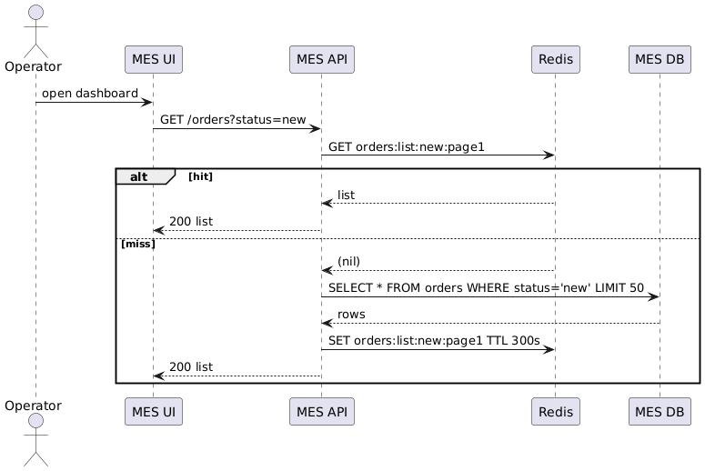
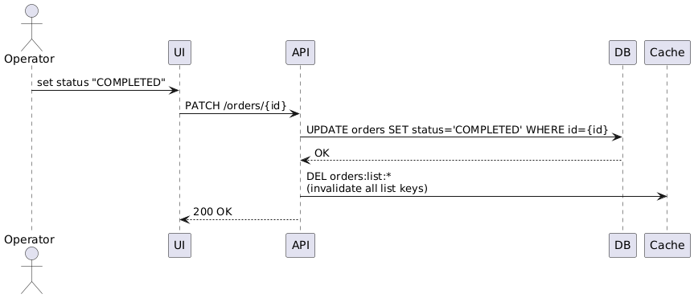

# Архитектурное решение по кешированию

⸻

## 1. Мотивация
* **Боль**: страница MES со списком заказов открывается 5-10 с; клиенты жалуются на долгий расчёт заказа — база перегружена повторными `SELECT`-запросами.  
* **Цель**: ускорить чтение «горячих» данных и разгрузить PostgreSQL, сохранив точность статусов.  
* **Что кешируем**:  
  * список заказов в MES (фильтр по статусу + пагинация) — самый частый запрос;  
  * результат расчёта стоимости (редко меняется, нужен многим).

> Остальные данные (карточки товаров, справочники) уже CDN-кешируются фронтендом — оптимизируем их позже.

⸻

## 2. Предлагаемое решение

### 2.1 Тип кеша
**Серверный Redis Cluster** (in-memory, ≈1 мс latency) — общедоступен операторам и API-клиентам. Клиентский браузерный кеш не подходит: операторы работают с разных мест и должны видеть общий актуальный список.

### 2.2 Паттерн
**Cache-Aside (lazy-loading) + TTL + Active Evict**

| Почему Cache-Aside | Почему _не_ Write-Through | Почему _не_ Refresh-Ahead |
|--------------------|---------------------------|---------------------------|
| Простой, прозрачно контролируем в коде | Замедлит каждый `UPDATE`, а их много (смены статусов) | Сложнее настройка; риск «самообновления» неактуальных данных |
| Кеширует только то, что реально спрашивают | Заполняет кеш редкими объектами | Не нужен pre-warm — список заказов уже «греется» операторами |

### 2.3 Стратегия инвалидации
* **Active Evict**: при любом `UPDATE`/`INSERT` заказа → `DEL orders:list:*`.  
* **TTL = 300 с** — страховка, если где-то забыли удалить ключ.  
* **Ключи**: `orders:list:{status}:{page}` и `price:order:{id}`.
* **Метрика hit/miss** отправляется в Prometheus (см. Task2) → цель hit ≥ 80 %, miss ≤ 20 %.

⸻

## 3. Диаграммы последовательности

### 3.1 Чтение списка заказов



### 3.2 Изменение статуса заказа



⸻

## 4. Инфраструктура
```
MES UI  →  MES API  →  Redis Cluster (3× primary + replicas)
                          ↘
                           ↘  (cache miss)
                            PostgreSQL (MES DB)
```
* Redis in-memory, **persistence AOF** every 5 s (не критично при падении — кеш восстановится).  
* Redis-client **lettuce** с auto-reconnect, `maxIdleTime` 30 с.

⸻

## 5. Сравнение стратегий инвалидации

| Стратегия | Плюсы | Минусы |
|-----------|-------|--------|
| TTL только | Реализуется «из коробки» | 5 мин могут показываться устаревшие статусы |
| Active Evict только | Сразу актуально | Риск забыть `DEL`, кеш «зацементируется» |
| **Комбо (наш выбор)** | Мгновенная свежесть + страховка TTL | Чуть больше кода, но надёжно |

⸻

## 6. Риски и митигация

| Риск | Как снизить |
|------|-------------|
| Несогласованность данных | Тест-покрытие всех точек, где меняется заказ; TTL 5 мин |
| Переполнение кеша | LRU-policy + мониторинг hit/miss, алерты при > 80 % RAM |
| Redis down | Fall-back: на miss сразу в БД; retry с exponential backoff |
* При отмене заказа очищаем `price:order:{id}` (Active Evict on cancel) — чтобы не отдавать устаревшую цену.

⸻

## 7. Эффект
* **Время загрузки списка**: 5–10 с → < 300 мс (hit)  
* **Нагрузка на MES DB**: −70 % `SELECT`  
* Операторы видят новые заказы < 1 с после создания  
* Клиенты получают цену быстрее, т.к. БД не забита чтениями

**Итого**: Cache-Aside с Redis и активной инвалидацией решает текущие проблемы скорости без сложных изменений архитектуры. 